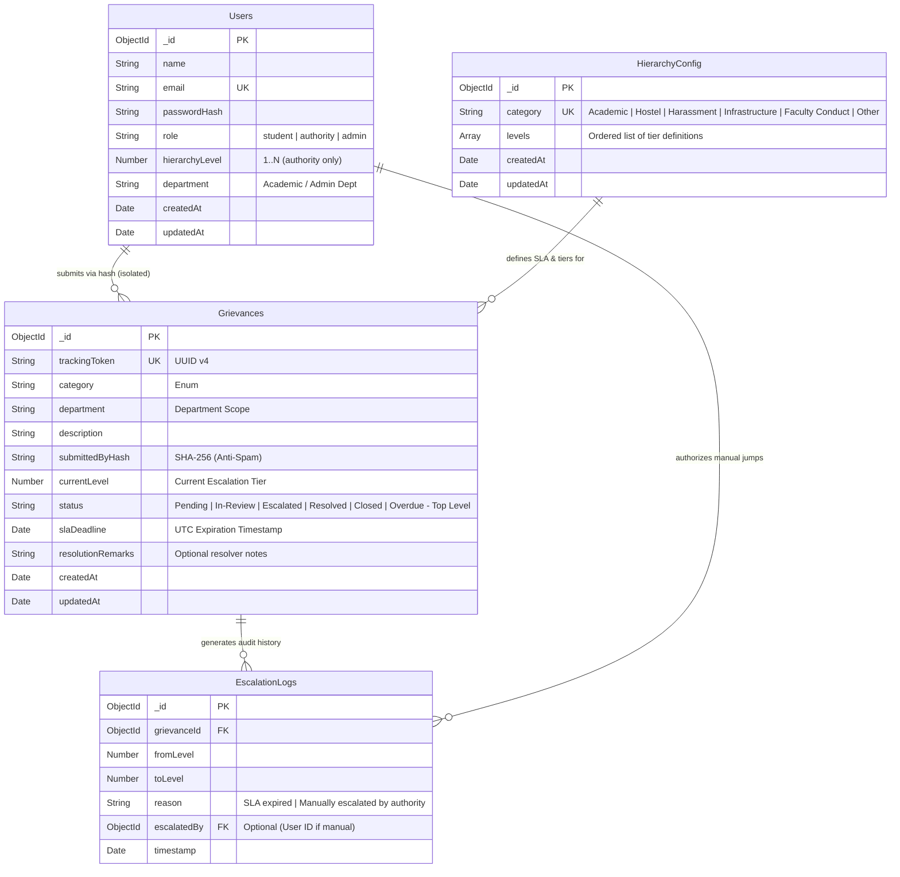

# Database Schema Specification

**Project Name:** Grievance Escalation Tracker  
**Document Version:** 1.0.0  
**Database Technology:** MongoDB (Document Store)  
**Object Data Modeling (ODM):** Mongoose (v8+)  
**Status:** Approved for Implementation  
**Reference Documents:** [PRD.md](file:///Users/utkarshjoshi/Desktop/Utkarsh%20Joshi/Grievance%20Escalation%20Tracker/docs/PRD.md), [USER_FLOWS.md](file:///Users/utkarshjoshi/Desktop/Utkarsh%20Joshi/Grievance%20Escalation%20Tracker/docs/USER_FLOWS.md)

---

## 1. Database Overview & Architecture

The Grievance Escalation Tracker uses MongoDB with Mongoose ODM to enforce schema validation, maintain data integrity, and support high-throughput asynchronous queries.

### Core Collections:
1. `Users`: System accounts for Students, Authorities, and Administrators.
2. `Grievances`: Core grievance entities containing anonymous metadata, current escalation tier, and SLA timers.
3. `EscalationLogs`: Immutable chronological audit logs tracking every tier transition (automatic SLA expiry or manual escalation).
4. `HierarchyConfig`: Dynamic configuration documents defining multi-level authority tiers, role titles, and SLA hours per category.

---

## 2. Entity Relationship Diagram (ERD)



---

## 3. Detailed Collection Schemas

### 3.1 `Users` Collection

**Purpose:** Stores user profiles and authentication credentials across all three operational roles.

| Field | Type | Required | Default | Enum / Constraints | Description |
| :--- | :--- | :--- | :--- | :--- | :--- |
| `_id` | `ObjectId` | Yes | Auto | MongoDB Internal | Primary key |
| `name` | `String` | Yes | — | Min: 2, Max: 100 chars | Full user name. *Hidden from students when role = authority*. |
| `email` | `String` | Yes | — | Unique, Lowercase, RFC 5322 Regex | Institutional email address for login and notifications. |
| `passwordHash`| `String` | Yes | — | bcrypt hash ($2b$10$) | Cryptographically hashed password. |
| `role` | `String` | Yes | `'student'` | `['student', 'authority', 'admin']` | User authorization role governing route access. |
| `hierarchyLevel` | `Number` | Conditional | `null` | Integer $\ge 1$ | Required if `role === 'authority'`. Defines the responder tier (1 = first responder). |
| `department` | `String` | Conditional | `null` | Standardized department string | Department affiliation (e.g., `'Computer Science'`, `'Hostel Block A'`). |
| `createdAt` | `Date` | Auto | `Date.now` | UTC Timestamp | Creation timestamp. |
| `updatedAt` | `Date` | Auto | `Date.now` | UTC Timestamp | Last update timestamp. |

#### Privacy & Security Note:
- Authority `name` and `email` are never exposed on public grievance tracking endpoints. Public views resolve titles through `HierarchyConfig.roleTitle`.

---

### 3.2 `Grievances` Collection

**Purpose:** Primary repository of grievance records, tracking tokens, lifecycle statuses, and active SLA expiration clocks.

| Field | Type | Required | Default | Enum / Constraints | Description |
| :--- | :--- | :--- | :--- | :--- | :--- |
| `_id` | `ObjectId` | Yes | Auto | MongoDB Internal | Primary key |
| `trackingToken`| `String` | Yes | `uuidv4()` | Unique, UUID v4 format | Public tracking identifier issued to complainant. |
| `category` | `String` | Yes | — | `['Academic', 'Hostel', 'Harassment', 'Infrastructure', 'Faculty Conduct', 'Other']` | Category governing hierarchy and routing. |
| `department` | `String` | No | `'General'` | String | Department target for routing (e.g., `'Computer Science'`, `'Hostel'`). |
| `description` | `String` | Yes | — | Min: 10, Max: 5000 chars | Comprehensive narrative of the grievance. |
| `submittedByHash`| `String` | Yes | — | 64-char Hex (SHA-256) | One-way cryptographic hash of submitter's user ID for rate limiting. **Never exposed to authorities.** |
| `currentLevel` | `Number` | Yes | `1` | Integer $\ge 1$ | Active escalation tier. |
| `status` | `String` | Yes | `'Pending'` | `['Pending', 'In-Review', 'Escalated', 'Resolved', 'Closed', 'Overdue - Top Level']` | Current operational state. |
| `slaDeadline` | `Date` | Yes | — | UTC Timestamp | Absolute timestamp when current tier's SLA expires. |
| `resolutionRemarks`| `String` | No | `null` | Max: 2000 chars | Official remarks entered by the resolving authority. |
| `createdAt` | `Date` | Auto | `Date.now` | UTC Timestamp | Grievance submission timestamp. |
| `updatedAt` | `Date` | Auto | `Date.now` | UTC Timestamp | Last modification timestamp. |

---

### 3.3 `EscalationLogs` Collection

**Purpose:** Append-only, immutable audit trail documenting every status escalation jump, trigger reason, and timestamp.

| Field | Type | Required | Default | Enum / Constraints | Description |
| :--- | :--- | :--- | :--- | :--- | :--- |
| `_id` | `ObjectId` | Yes | Auto | MongoDB Internal | Primary key |
| `grievanceId` | `ObjectId` | Yes | — | Ref: `Grievances._id` | Foreign key reference to parent grievance. |
| `fromLevel` | `Number` | Yes | — | Integer $\ge 1$ | Escalation tier before jump. |
| `toLevel` | `Number` | Yes | — | Integer $\ge 1$ | New escalation tier after jump. |
| `reason` | `String` | Yes | — | String (e.g. `'SLA expired'`, `'Manually escalated by authority'`) | Justification or trigger condition for escalation. |
| `escalatedBy` | `ObjectId` | No | `null` | Ref: `Users._id` | User ID of authority if manually escalated; `null` if auto-escalated by cron. |
| `timestamp` | `Date` | Yes | `Date.now` | UTC Timestamp | Exact date and time escalation occurred. |

---

### 3.4 `HierarchyConfig` Collection

**Purpose:** Defines the escalation structure, tier titles, and SLA durations for each grievance category.

| Field | Type | Required | Default | Enum / Constraints | Description |
| :--- | :--- | :--- | :--- | :--- | :--- |
| `_id` | `ObjectId` | Yes | Auto | MongoDB Internal | Primary key |
| `category` | `String` | Yes | — | Unique Category Enum | Category identifier (e.g., `'Harassment'`). |
| `levels` | `Array` | Yes | `[]` | Subdocuments Array | Ordered list of escalation tiers. |
| `levels.levelNumber`| `Number`| Yes | — | Integer $\ge 1$ (Sequential) | Tier depth (1 = Level 1, 2 = Level 2, etc.). |
| `levels.roleTitle` | `String`| Yes | — | String (e.g., `'Class Representative'`) | Generic public-facing title for this tier. |
| `levels.slaHours` | `Number`| Yes | — | Float $> 0$ (e.g., `24`, `48`, `0.05` for demo) | Maximum hours permitted before auto-escalation. |
| `createdAt` | `Date` | Auto | `Date.now` | UTC Timestamp | Record creation timestamp. |
| `updatedAt` | `Date` | Auto | `Date.now` | UTC Timestamp | Last configuration update. |

---

## 4. Realistic JSON Examples

### 4.1 Sample `Users` Documents

```json
[
  {
    "_id": {"$oid": "66e85a10f1a2b3c4d5e60001"},
    "name": "Alex Mercer",
    "email": "student.alex@university.edu",
    "passwordHash": "$2b$10$wT5iGq7Ld5V1K9Y6Pq5r9.Z2p1h6x4X3q0u8Y7a2b3c4d5e6f7g8h",
    "role": "student",
    "department": "Computer Science",
    "createdAt": "2026-09-01T08:00:00.000Z",
    "updatedAt": "2026-09-01T08:00:00.000Z"
  },
  {
    "_id": {"$oid": "66e85a10f1a2b3c4d5e60002"},
    "name": "Dr. Sarah Jenkins",
    "email": "hod.cs@university.edu",
    "passwordHash": "$2b$10$eK2jH8nM1L0p9O8i7U6y5.X1w2v3u4t5s6r7q8p9o0n1m2l3k4j5i",
    "role": "authority",
    "hierarchyLevel": 2,
    "department": "Computer Science",
    "createdAt": "2026-09-01T08:00:00.000Z",
    "updatedAt": "2026-09-01T08:00:00.000Z"
  },
  {
    "_id": {"$oid": "66e85a10f1a2b3c4d5e60003"},
    "name": "Prof. Arthur Vance",
    "email": "dean.academics@university.edu",
    "passwordHash": "$2b$10$u8Y7a2b3c4d5e6f7g8h9i.wT5iGq7Ld5V1K9Y6Pq5r9Z2p1h6x4X3",
    "role": "authority",
    "hierarchyLevel": 3,
    "department": "Academic Affairs",
    "createdAt": "2026-09-01T08:00:00.000Z",
    "updatedAt": "2026-09-01T08:00:00.000Z"
  },
  {
    "_id": {"$oid": "66e85a10f1a2b3c4d5e60004"},
    "name": "Campus Administrator",
    "email": "admin@university.edu",
    "passwordHash": "$2b$10$Z2p1h6x4X3q0u8Y7a2b3c.wT5iGq7Ld5V1K9Y6Pq5r94d5e6f7g8h",
    "role": "admin",
    "createdAt": "2026-09-01T08:00:00.000Z",
    "updatedAt": "2026-09-01T08:00:00.000Z"
  }
]
```

### 4.2 Sample `HierarchyConfig` Document

```json
{
  "_id": {"$oid": "66e85b20f1a2b3c4d5e60010"},
  "category": "Academic",
  "levels": [
    {
      "levelNumber": 1,
      "roleTitle": "Course Instructor / Class Advisor",
      "slaHours": 24
    },
    {
      "levelNumber": 2,
      "roleTitle": "Head of Department (HOD)",
      "slaHours": 48
    },
    {
      "levelNumber": 3,
      "roleTitle": "Dean of Academic Affairs",
      "slaHours": 72
    },
    {
      "levelNumber": 4,
      "roleTitle": "Vice Chancellor / Ombudsperson",
      "slaHours": 96
    }
  ],
  "createdAt": "2026-09-01T08:00:00.000Z",
  "updatedAt": "2026-09-10T14:30:00.000Z"
}
```

### 4.3 Sample `Grievances` Document

```json
{
  "_id": {"$oid": "66e85c30f1a2b3c4d5e60020"},
  "trackingToken": "8f4b7a12-9c3d-4e5f-b6a1-2d3e4f5a6b7c",
  "category": "Academic",
  "department": "Computer Science",
  "description": "Continuous lab equipment failure during Operating Systems practical sessions. Hardware workstations in Lab 3 have not had compiler toolchains updated, blocking lab submissions.",
  "submittedByHash": "e3b0c44298fc1c149afbf4c8996fb92427ae41e4649b934ca495991b7852b855",
  "currentLevel": 2,
  "status": "In-Review",
  "slaDeadline": "2026-09-18T14:00:00.000Z",
  "resolutionRemarks": null,
  "createdAt": "2026-09-15T10:00:00.000Z",
  "updatedAt": "2026-09-16T10:00:00.000Z"
}
```

### 4.4 Sample `EscalationLogs` Documents

```json
[
  {
    "_id": {"$oid": "66e85d40f1a2b3c4d5e60030"},
    "grievanceId": {"$oid": "66e85c30f1a2b3c4d5e60020"},
    "fromLevel": 1,
    "toLevel": 2,
    "reason": "SLA expired",
    "escalatedBy": null,
    "timestamp": "2026-09-16T10:00:00.000Z"
  }
]
```

---

## 5. Indexing Strategy

To support high-velocity queries, background cron checks, and token lookups, the following indexes are specified:

| Collection | Index Fields | Type | Purpose / Query Optimization |
| :--- | :--- | :--- | :--- |
| `Users` | `{ email: 1 }` | Unique | Enforces unique email constraint and accelerates login lookups. |
| `Users` | `{ role: 1, hierarchyLevel: 1, department: 1 }` | Compound | Fast resolution of eligible resolvers during notification dispatch. |
| `Grievances` | `{ trackingToken: 1 }` | Unique | Immediate $O(1)$ public tracking lookup without scanning full collection. |
| `Grievances` | `{ status: 1, slaDeadline: 1 }` | Compound | **Critical for Escalation Engine:** Allows `node-cron` to quickly filter expired tickets. |
| `Grievances` | `{ currentLevel: 1, department: 1, status: 1 }` | Compound | Optimizes authority dashboard triage queue queries. |
| `Grievances` | `{ submittedByHash: 1, createdAt: -1 }` | Compound | Supports rapid abuse rate-limiting and student dashboard queries. |
| `EscalationLogs`| `{ grievanceId: 1, timestamp: 1 }` | Compound | Fast retrieval of sorted audit timelines for public tracking. |
| `HierarchyConfig`| `{ category: 1 }` | Unique | Ensures single configuration per category and optimizes SLA lookups. |

---

## 6. Mongoose Models Implementation Blueprint

Below are production-ready Mongoose schema definitions for the future coding agent:

```javascript
// models/User.js
const mongoose = require('mongoose');

const userSchema = new mongoose.Schema({
  name: { type: String, required: true, trim: true },
  email: { type: String, required: true, unique: true, lowercase: true, trim: true },
  passwordHash: { type: String, required: true },
  role: { 
    type: String, 
    enum: ['student', 'authority', 'admin'], 
    default: 'student',
    required: true 
  },
  hierarchyLevel: { 
    type: Number, 
    default: null,
    validate: {
      validator: function(val) {
        return this.role !== 'authority' || (typeof val === 'number' && val >= 1);
      },
      message: 'hierarchyLevel is required for authority role'
    }
  },
  department: { type: String, default: null }
}, { timestamps: true });

userSchema.index({ role: 1, hierarchyLevel: 1, department: 1 });

module.exports = mongoose.model('User', userSchema);
```

```javascript
// models/HierarchyConfig.js
const mongoose = require('mongoose');

const levelSchema = new mongoose.Schema({
  levelNumber: { type: Number, required: true, min: 1 },
  roleTitle: { type: String, required: true, trim: true },
  slaHours: { type: Number, required: true, min: 0.01 }
}, { _id: false });

const hierarchyConfigSchema = new mongoose.Schema({
  category: { 
    type: String, 
    required: true, 
    unique: true,
    enum: ['Academic', 'Hostel', 'Harassment', 'Infrastructure', 'Faculty Conduct', 'Other']
  },
  levels: { type: [levelSchema], required: true }
}, { timestamps: true });

module.exports = mongoose.model('HierarchyConfig', hierarchyConfigSchema);
```

```javascript
// models/Grievance.js
const mongoose = require('mongoose');
const { v4: uuidv4 } = require('uuid');

const grievanceSchema = new mongoose.Schema({
  trackingToken: { 
    type: String, 
    required: true, 
    unique: true, 
    default: () => uuidv4() 
  },
  category: { 
    type: String, 
    required: true, 
    enum: ['Academic', 'Hostel', 'Harassment', 'Infrastructure', 'Faculty Conduct', 'Other'] 
  },
  department: { type: String, default: 'General' },
  description: { type: String, required: true, minlength: 10, maxlength: 5000 },
  submittedByHash: { type: String, required: true, index: true },
  currentLevel: { type: Number, required: true, default: 1, min: 1 },
  status: { 
    type: String, 
    required: true, 
    enum: ['Pending', 'In-Review', 'Escalated', 'Resolved', 'Closed', 'Overdue - Top Level'],
    default: 'Pending'
  },
  slaDeadline: { type: Date, required: true },
  resolutionRemarks: { type: String, default: null }
}, { timestamps: true });

grievanceSchema.index({ status: 1, slaDeadline: 1 });
grievanceSchema.index({ currentLevel: 1, department: 1, status: 1 });
grievanceSchema.index({ submittedByHash: 1, createdAt: -1 });

module.exports = mongoose.model('Grievance', grievanceSchema);
```

```javascript
// models/EscalationLog.js
const mongoose = require('mongoose');

const escalationLogSchema = new mongoose.Schema({
  grievanceId: { 
    type: mongoose.Schema.Types.ObjectId, 
    ref: 'Grievance', 
    required: true,
    index: true 
  },
  fromLevel: { type: Number, required: true, min: 1 },
  toLevel: { type: Number, required: true, min: 1 },
  reason: { type: String, required: true, trim: true },
  escalatedBy: { 
    type: mongoose.Schema.Types.ObjectId, 
    ref: 'User', 
    default: null 
  },
  timestamp: { type: Date, default: Date.now }
});

escalationLogSchema.index({ grievanceId: 1, timestamp: 1 });

module.exports = mongoose.model('EscalationLog', escalationLogSchema);
```
