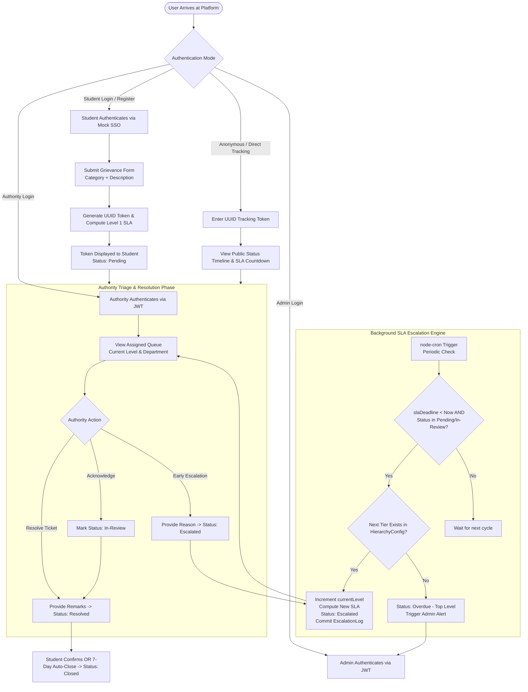
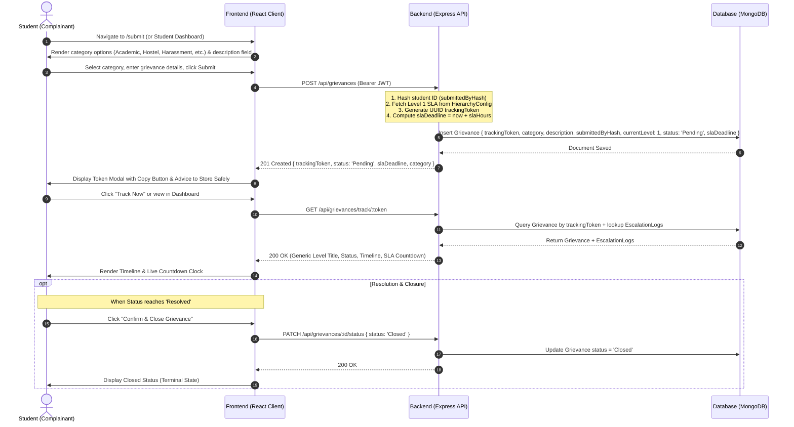
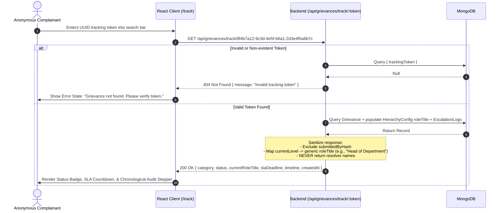
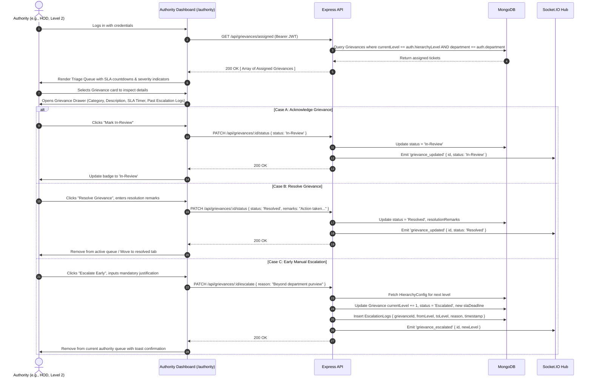
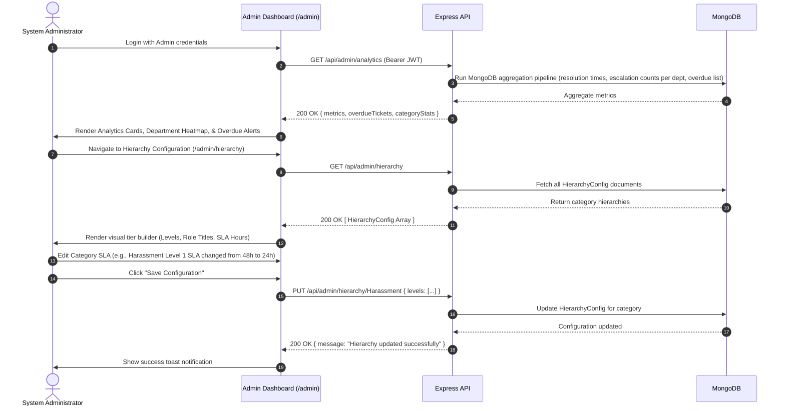
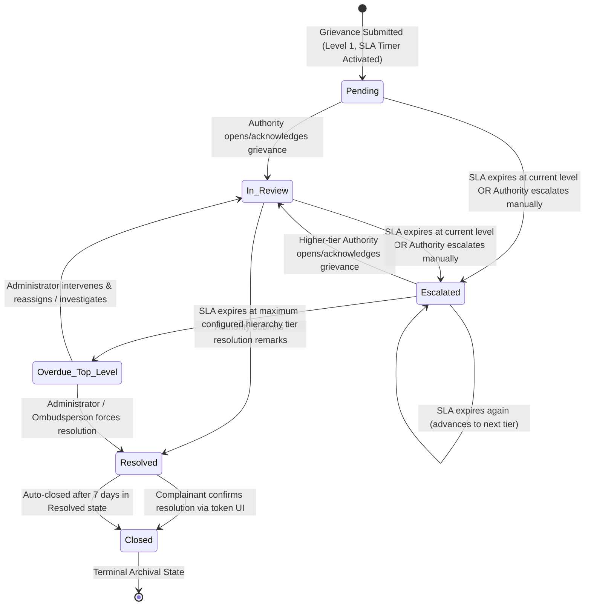

# User Flows & System Interaction Specification

**Project Name:** Grievance Escalation Tracker  
**Document Version:** 1.0.0  
**Status:** Approved for Implementation  
**Reference Document:** [PRD.md](file:///Users/utkarshjoshi/Desktop/Utkarsh%20Joshi/Grievance%20Escalation%20Tracker/docs/PRD.md)

---

## 1. Overall System Lifecycle Flow

The Grievance Escalation Tracker coordinates an end-to-end asynchronous workflow between students, authority resolvers, the automated escalation engine, and institutional administrators.



---

## 2. Student / Complainant Flow

The student journey focuses on high-speed submission, zero identity exposure, and friction-free tracking.



### Step-by-Step Student Experience:
1. **Authentication:** Student logs in via `/login` or registers via `/register`.
2. **Dashboard Overview:** Student arrives at `/student` displaying their past submissions and token shortcuts.
3. **Grievance Initiation:** Student clicks *"Submit New Grievance"*.
4. **Form Completion:** Student selects one of 6 categories (Academic, Hostel, Harassment, Infrastructure, Faculty Conduct, Other), enters a comprehensive description, and submits.
5. **Token Delivery:** A secure modal presents the UUID token with a single-click copy utility. The user is cautioned: *"Save this tracking token. It is your only cryptographic proof of submission."*
6. **Live Tracking:** Student navigates to `/track/:token` to monitor the live countdown and audit timeline.
7. **Closure Confirmation:** Once marked `Resolved` by an authority, the student can confirm satisfactory redressal, moving the status to `Closed`.

---

## 3. Anonymous Public Tracking Flow

Anyone with a valid UUID tracking token can inspect progress without logging into an institutional account.



---

## 4. Authority / Resolver Flow

Authorities are assigned grievances based on their designated hierarchy level and department.



---

## 5. Administrator Flow

Administrators manage system-wide escalation hierarchies, calibrate category SLA windows, inspect operational telemetry, and handle breached terminal escalations.



---

## 6. Detailed Automatic Escalation Engine Flow

The automated escalation engine is the technical backbone of the system, guaranteeing that bureaucratic inaction automatically triggers higher-level oversight.

```mermaid
flowchart TD
    CronStart([Cron Job Triggered: Every N Minutes]) --> QueryExpired[Query DB: status IN ('Pending', 'In-Review') AND slaDeadline <= now()]
    QueryExpired --> RecordsFound{Grievances Found?}
    
    RecordsFound -->|No| CronEnd([End Cron Execution Cycle])
    RecordsFound -->|Yes| ForEach[Iterate Each Expired Grievance]
    
    ForEach --> FetchConfig[Fetch HierarchyConfig for Grievance Category]
    FetchConfig --> CheckNextLevel{Does Level = currentLevel + 1 Exist?}
    
    CheckNextLevel -->|Yes| CalculateNext[Read nextLevel.slaHours & roleTitle<br>Compute newDeadline = now + slaHours<br>newLevel = currentLevel + 1]
    CalculateNext --> AtomicUpdate[Atomic DB Update: Grievance<br>currentLevel = newLevel<br>status = 'Escalated'<br>slaDeadline = newDeadline]
    AtomicUpdate --> WriteAudit[Insert EscalationLog:<br>grievanceId, fromLevel, toLevel,<br>reason: 'SLA expired', timestamp]
    WriteAudit --> DispatchNotifs[1. Trigger Nodemailer to Level N+1 Authority<br>2. Emit Socket.IO 'grievance_escalated'<br>3. Send Email to Student if registered]
    DispatchNotifs --> NextRecord{More Records in Batch?}
    
    CheckNextLevel -->|No: Reached Top Tier| TopTierBreach[Atomic DB Update: Grievance<br>status = 'Overdue - Top Level']
    TopTierBreach --> WriteTopAudit[Insert EscalationLog:<br>reason: 'SLA expired at Top Tier - Escalation Cap Reached']
    TopTierBreach --> AdminAlert[1. Trigger High-Priority Admin Email<br>2. Emit Socket.IO 'admin_overdue_alert']
    AdminAlert --> NextRecord
    
    NextRecord -->|Yes| ForEach
    NextRecord -->|No| CronEnd
```

---

## 7. Grievance State Machine

A grievance progresses through a strictly defined finite state machine.



### State Transition Rules:
| Current State | Target State | Trigger / Condition | Permitted Actors |
| :--- | :--- | :--- | :--- |
| `[*] (None)` | `Pending` | Complainant submits valid grievance form | Student / Complainant |
| `Pending` | `In-Review` | Assigned authority acknowledges the ticket | Assigned Authority |
| `Pending` | `Escalated` | `slaDeadline` expires OR Authority initiates early escalation | node-cron Engine / Assigned Authority |
| `In-Review` | `Resolved` | Authority submits formal resolution remarks | Assigned Authority |
| `In-Review` | `Escalated` | `slaDeadline` expires without resolution OR Manual escalation | node-cron Engine / Assigned Authority |
| `Escalated` | `In-Review` | Newly assigned senior authority acknowledges ticket | Senior Tier Authority |
| `Escalated` | `Overdue - Top Level` | SLA expires when `currentLevel` equals maximum hierarchy tier | node-cron Engine |
| `Overdue - Top Level`| `Resolved` | System Admin / Ombudsperson resolves emergency ticket | Administrator |
| `Resolved` | `Closed` | Student confirms resolution OR 7-day timeout expires | Complainant / System Auto-Worker |

---

## 8. Error, Boundary & Edge Case Flows

### 8.1 Invalid or Malformed Tracking Token
- **Condition:** User enters a non-existent UUID or corrupted string at `/track`.
- **System Behavior:** Backend returns `404 Not Found` with `{ success: false, error: "ERR_INVALID_TOKEN", message: "No grievance found matching this tracking token." }`.
- **UI UX:** Client displays a styled empty state card with guidance to check for typo or trailing whitespace.

### 8.2 Expired SLA During Concurrent Authority Action
- **Condition:** Authority attempts to click "Resolve" at the exact moment the `node-cron` job runs an auto-escalation.
- **System Behavior:** Handled via Mongoose atomic conditional updates (`findOneAndUpdate({ _id, currentLevel: req.user.hierarchyLevel, status: { $ne: 'Escalated' } })`). If the cron job escalated first, the authority update fails with `409 Conflict` (`"Grievance has already been escalated to Tier N+1"`).

### 8.3 No Next Hierarchy Level Configured
- **Condition:** An escalation occurs on a category whose `HierarchyConfig` lacks Level $N+1$.
- **System Behavior:** The system prevents incrementing out-of-bounds, transitions status immediately to `Overdue - Top Level`, logs the exception, and alerts the Administrator.

### 8.4 Unauthorized Authority Access Attempt
- **Condition:** An authority from the *Civil Engineering* department attempts to view or update a *Computer Science* departmental grievance.
- **System Behavior:** RBAC middleware verifies `req.user.department === grievance.department`. If mismatched, returns `403 Forbidden` (`"Access Denied: You are not authorized to triage grievances for this department."`).

### 8.5 Duplicate / Rapid Spam Submissions
- **Condition:** A student attempts to submit 50 grievances within 1 minute.
- **System Behavior:** Rate limiter middleware checks `submittedByHash` within an in-memory window. Rejections return `429 Too Many Requests` (`"Submission limit exceeded. Please wait 15 minutes before filing another grievance."`).

### 8.6 Notification / SMTP Delivery Failure
- **Condition:** Institutional SMTP server is unreachable or drops connection during escalation email dispatch.
- **System Behavior:** Email dispatch is wrapped in a `try/catch` non-blocking block. The escalation database transaction commits successfully; the error is logged to server logs without rolling back the state change.

### 8.7 Backend / Network Disconnection on Client
- **Condition:** User's network drops during status polling or socket event.
- **System Behavior:** Socket.IO client executes exponential backoff reconnection. REST API wrappers render an ambient "Offline / Reconnecting" banner.
